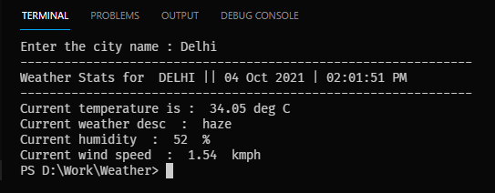
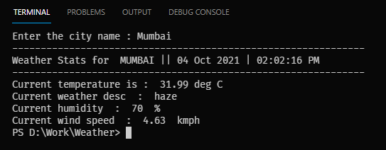
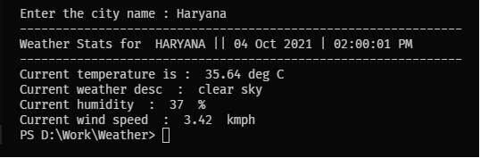

<h1>Used openweather api for fetching Weather Data.</h1>

```diff
-Temperature.
-Moisture.
-Wind speed.
-Humidity.
-Moisture bold.
-Weather description.🥰
```

<h2>Delhi Weather</h2>


<h2>Mumbai Weather</h2>


<h2>Haryana Weather</h2>

