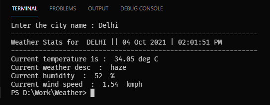
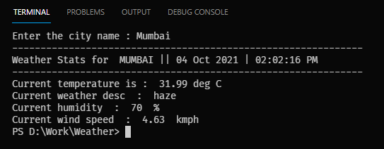
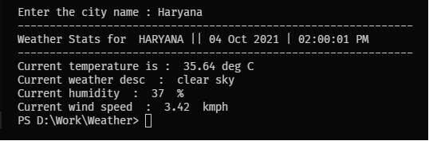

<h1>Used openweather api for fetching Weather Data.</h1>

```diff
-Temperature
+Moisture bold
!Wind speed 
-Humidity
@@Weather description.@@🥰
```

<h2>Delhi Weather</h2>


<h2>Mumbai Weather</h2>


<h2>Haryana Weather</h2>

